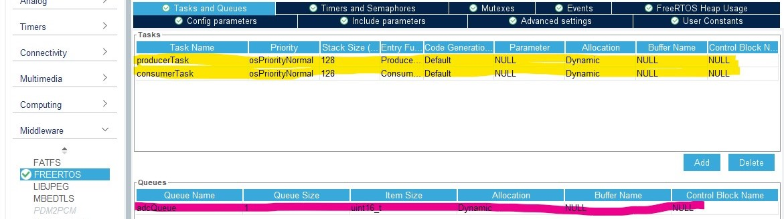
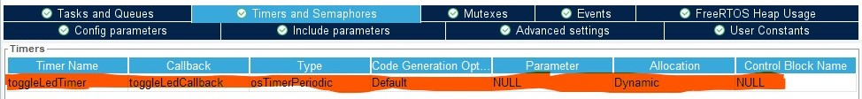

# CMSIS-RTOS and STM32 Peripherals

# Contents

* [Overview](#Overview)
    * [Design](#Design)
        * [RTOS](#RTOS)
            * [Producer-Consumer Model](#Producer-Consumer-Model)
            * [Software Timer](#Software-Timer)
    * [Implementation](#Implementation)
        * [STM32CubeMX](#STM32CubeMX)
            * [Timebase](#Timebase)
            * [CMSIS-RTOS](#CMSIS-RTOS)
        * [Source Code](#Source-Code)
    * [Demonstrations](#Demonstrations)

# Overview

This was designed to test timing of **RTOS** tasks, while maintaining **ADC** and **GPIO Output** peripherals. This was implemented on a **STM32-F401RE Nucleo Board**.

## Design

We have designed this program to :

<ul>
    <li>Read 10-bit resolution <b>ADC1</b> peripheral <u>and</u> pass data between <b>RTOS</b> threads <em>every 10 ms</em>.</li>
    <li>Toggle <b>LD2 GPIO</b> pin <u>and</u> transmit <b>RTOS Kernel Tick</b> time via <b>USART2</b> <em>every 100 ms</em>.</li>
</ul>

### RTOS

We are writing the `Middleware` with **CMSIS-RTOS v2 API**. This is a **FreeRTOS** wrapper designed for **Cortex-M** processor-based devices. This enables concurrent execution of program threads.

We have described our high-level design with the following execution diagram :

#### Producer-Consumer Model

The **RTOS** tasks are based on a **Producer**-**Consumer** relationship. We've designed task execution to adhere to the following block diagram :

While adhering to our block diagram, a decision was made to read <b>ADC</b> via <b>DMA</b> stream to reduce the <b>CPU</b> involvement in thread concurrency.

The **Producer**-**Consumer** model entails :

<ul>
    <li>The <b>Producer</b> task starting the <b>ADC</b> read via <b>DMA</b> and sending it to an <b>RTOS</b> queue.</li>
    <li>The <b>Consumer</b> task receiving the <b>ADC</b> data.</li>
</ul>

If the **Producer** task is unable to receive data from **Consumer** task, we transmit an error message via <b>USART2</b> peripheral. Since the **CMSIS-RTOS API** enables us the control of thread functions through **Thread Management**, the error message will be used to notify us of system malfunction.

We are able to achieve the execution period in our design through :
<ul>
    <li>Ensuring equal priority tasks don't preempt each other.</li>
    <li>Periodically moving tasks between <b>READY</b> and <b>BLOCKED</b> states.</li>
</ul>

Note : A benefit of implementing our solution with **CMSIS-RTOS** is that the default time resolution for **CMSIS-OS** is <i>1000 us = 1 ms</i>. This can be modified to be set to <i>1 us</i>, but for our purposes, we require the millisecond scale timing.

#### Software Timer

We are toggling the **LD2** with an **RTOS** auto-reload software timer. **FreeRTOS** software timers are similar to software interrupts, but operate at the task level. The **Timer Service Task** blocks itself and wakes up when the software timer expires. We invoke a callback function here to toggle **LD2**.

## Implementation

### STM32CubeMX

The project was generated using the <b>STM32CubeMX</b> Graphical Tool Software to achieve this system design. This configuration can be viewed and modified in the [(`CMSIS_ADC_Test.ioc`)](CMSIS_ADC_Test.ioc) file.

We selected the [Makefile](Makefile) toolchain to work with individually installed tools on the **VSCode** Editor.

#### Timebase

We ensured the **CPU** clock (i.e. **HCLK**) is configured to maximum frequency of <i>84 MHz</i> in the `Clock Configuration` tab. This provides us with microsecond scale timing given our period of <i>~12 ns</i>.

The **FreeRTOS** scheduler requires **SysTick** to have a relatively low priority whereas the **STM32 HAL** framework provides **SysTick** a high priority for triggering interrupts.
To fix this conflict, we follow <b>[Digi-Key](https://www.digikey.ca/en/maker/projects/getting-started-with-stm32-introduction-to-freertos/ad275395687e4d85935351e16ec575b1)</b>'s suggestion to configure the **System Core Timebase Source** to an unused timer, **TIM4**.

#### RTOS

We have initialized the `producerTask` & `consumerTask` tasks to have the equal priority and send/receive data via the `adcQueue` queue. The periodic timer is declared here as well.

| RTOS Configuration
| :-------------------------:
| 
| 

Some more minor configurations are captured in the [`STM32CubeMX_Config`](Figures/STM32CubeMX_Config) directory.

### Source Code

The source code is written using a **Hardware Abstraction Layer** in [(`main.c`)](Core/Src/main.c).

## Demonstration

The videos in the [`Demonstrations`](Demonstrations) directory show the output on the <b>STM32 Nucleo Board</b> as well as the <b>UART Communication</b> send to the serial terminal.
